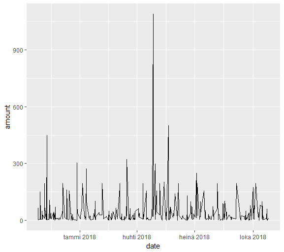

```{r setup, include=FALSE}
knitr::opts_chunk$set(echo = TRUE)
```

```{r,include=FALSE, echo=FALSE,warning=FALSE}
paketit<-c("tidyr","magrittr","dplyr","data.table","ggplot2")
lapply(paketit,library,character.only=T)
```

## R Markdown testing

### So far, so good

I'm participating in this open datascience course and I'm now supposed to start my own project, work on it in RStudio, communicate it by using RMarkdown and share it via GitHub. Let's see how frightened I will be of this "new technology".

<iframe width="560" height="315" src="https://www.youtube.com/embed/6FWUjJF1ai0" frameborder="0" allowfullscreen></iframe>

### First I was asked to provide you with this
Check out my [GitHub](https://github.com/Sirke/IODS-project)!!

### Then to business

The following has nothing to do with the actual course work. I'm just testing out stuff. 

I first made the mistake of placing the datafile that I next wanted to read in, to a separate folder inside the IODS-project-folder. Therefore, when I tried to read in the file, my code wasn't able to find it. After some googling I found out that this was because R console and Rmarkdown have separate independent working directories. You can read about this issue [here](https://stackoverflow.com/questions/25834007/read-table-and-read-csv-both-error-in-rmd).

So I start off with checking that I'm in the right working directory  

```{r,echo=TRUE}
getwd()
```
  
Everything's in order. So now let's read in the data that consists of my money expenditure during the past year.  


```{r,echo=TRUE}
money<-read.csv("Sirkesjam.csv",header=TRUE)
#let's see the first few rows
head(money)

```

Let's plot the data to see whether there are any nice (or worrying) patterns to see.  

```{r,echo=TRUE}
require(ggplot2)
ggplot(data=money,aes(date, amount))+geom_line()
```

For some reason the plot looks different in R compared to the knitted outcome shown above. I will get back to this later..  
Here's how the plot looks like in R:

```{r echo=FALSE, out.width='100%'}

```

My idea is to study whether I use more money on weekends or during holiday seasons. I could imagine that this is the case BUT, normally during weekends and holidays I go out hiking somewhere in the forests where there is less opportunities to use money so I might be wrong.  


